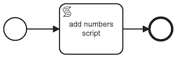
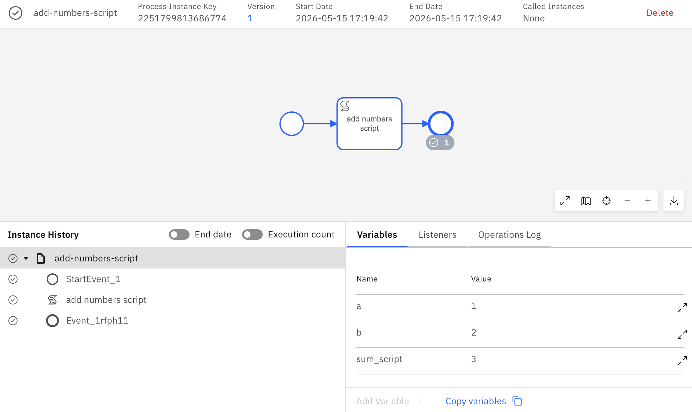
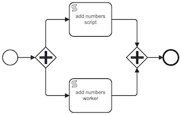
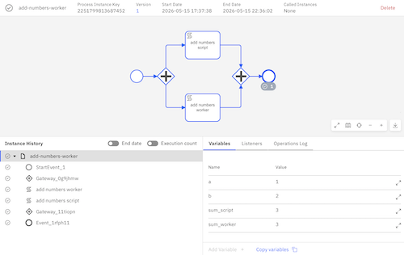
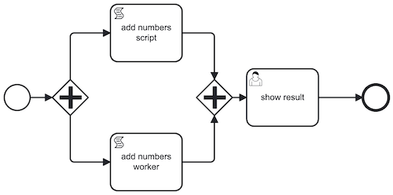
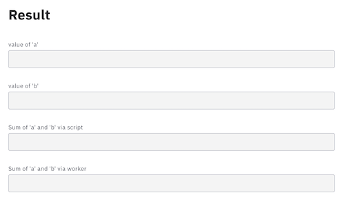
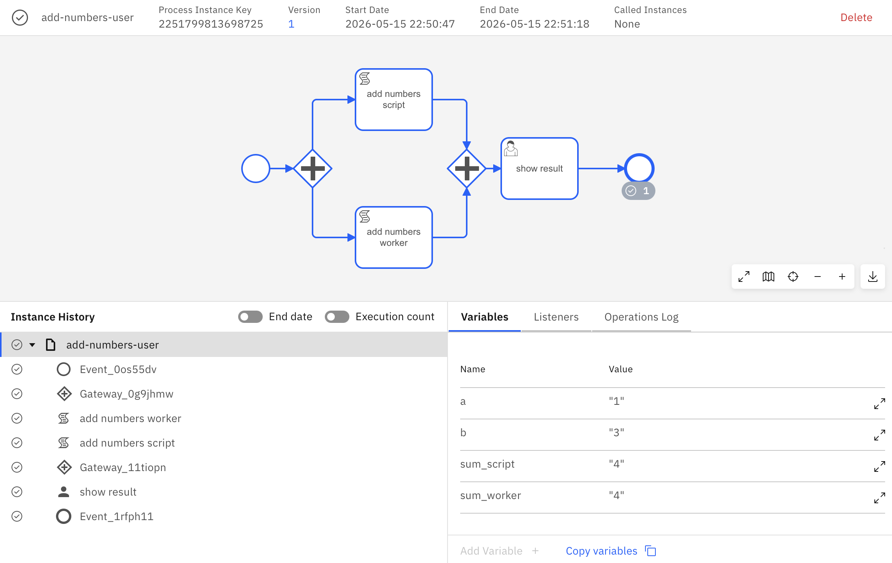
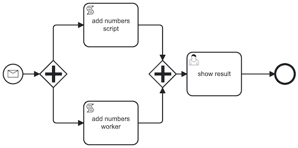
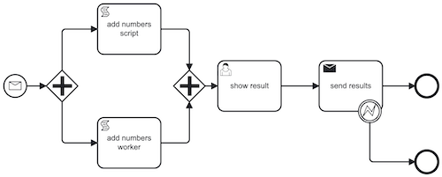
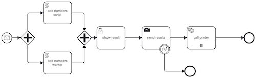

# Basic examples with Camunda
    
These examples are based on Camunda 8.9. They are tested using a [Docker Compose](https://github.com/camunda/camunda-distributions/tree/main/docker-compose/versions/camunda-8.9) deployment using the [full deployment configuration](https://github.com/camunda/camunda-distributions/blob/main/docker-compose/versions/camunda-8.9/docker-compose-full.yaml)

The example requires the use of [Camunda Modeler](https://camunda.com/download/modeler/). To properly use the example is required to configure the connection between the Camunda Modeler and the Camunda Engine:
* check if the c8run connection reported at the bottom of the window has a "green" icon
* if not configure the connection with the following parameters
    * Target: Camunda 8 Self-Managed
    * Cluster URL: http://localhost:8080/v2
    * Tenant ID: <i>leave empty</i>
    * Operate URL: http://localhost:8080/operate
    * Tasklist URL: http://localhost:8080/tasklist
    * Authentication: OAuth
    * Client ID: orchestration
    * Client secret: secret
    * OAuth token URL: http://localhost:18080/auth/realms/camunda-platform/protocol/openid-connect/token
    * OAuth audience: orchestration-api
    * OAuth scope: <i>leave empty</i>

These example are using a REST client developed using the [@Camunda8/sdk](https://camunda.github.io/camunda-8-js-sdk/) nodejs package. Before running the example is required to install the package running on a terminal `npm install`

## Script task

The [script task](./executable/add_numbers_script.bpmn) example shows how to make Camunda running a piece of code.

Check that the script task properties have:
* Implementation: FEEL expression
* result variable: `sum_script`
* FEEL expression: `a+b`

#### Steps
- open [script task model](./executable/add_numbers_script.bpmn) in Camunda Modeler
- deploy the model on Camunda Engine (click on the :rocket: icon)
- run the process specifying a value for the variables `a` and `b`, e.g. `{"a": 1, "b": 2}` (click on the :arrow_forward: icon)
- open localhost:8080/operate to see if the process has properly concluded and the `sum_script` has the correct value

## Worker task

The [worker task](./executable/add_numbers_worker.bpmn) example shows how to make Camunda running a piece of code on an external process called <i>worker</i>.

Check that the properties of the script task named `add number worker` have:
* Implementation: Job worker
* Job type: `add-numbers-worker`
* Output mapping > Process variable name: `sum_worker`
* Output mapping > Variable assignment name: `sum_result`

The code of the job worker is available at [add-number-worker.js](./src/worker/add-numbers-worker.js). It corresponds to an application that subscribes to a topic that corresponds to the job type defined in the BPMN model, i.e., `add-numbers-worker`. 

#### Steps
- on a terminal run the worker with `node ./src/worker/add-number-worker.js`
- open [script worker model](./executable/add_numbers_worker.bpmn) in Camunda Modeler
- deploy the model on Camunda Engine (click on the :rocket: icon)
- run the process specifying a value for the variables `a` and `b`, e.g. `{"a": 1, "b": 2}` (click on the :arrow_forward: icon)
- open localhost:8080/operate to see if the process has properly concluded and the `sum_script` and `sum_worker` have the correct values

## User task

The [user task](./executable/add_numbers_user.bpmn) example shows how to involve a human being in the process using the [result form](./executable/form_result.form).

Check that the properties of the user task named `show result` have:
* Form > Type : Camunda Form
* Form Id: `add_numbers_results_form` (this must correspond to the id in the form file) 

#### Steps
- on a terminal run the worker with `node ./src/worker/add-numbers-worker.js` (if it is not already running from the previous example)
- open [result form](./executable/form_result.form) in Camunda Modeler
- deploy the form on Camunda Engine (click on the :rocket: icon)
- open [user task model](./executable/add_numbers_user.bpmn) in Camunda Modeler
- deploy the model on Camunda Engine (click on the :rocket: icon)
- run the process specifying a value for the variables `a` and `b`, e.g. `{"a": 1, "b": 2}` (click on the :arrow_forward: icon)
- open localhost:8080/tasklist and complete the task 
- open localhost:8080/operate to see if the process has properly concluded and the `sum_script` and `sum_worker` have the correct values

## Starting a process programmatically

This example shows how it is possible to start a process deployed on Camunda from an external application. 

The [start_process.js](./src/start/start_process.js) contains the code to start the process.

#### Steps
- in the localhost:8080/operate dashboard select a deployed process where the start event is a <i>none start event</i>
- copy the process id 
- open a terminal and run `node src/start/start_process.js [processId]`

FYI, the process id of the examples discussed above are: `add-numbers-script`, `add-numbers-worker`, `add-numbers-user`.

## Starting a process with a message

The [start message example](./executable/add_numbers_start_message.bpmn) shows how to run a process that requires a message as to start.

In the start event properties, check that the message name value that correponds to `adding-numbers-message`.

The [start_process_message.js](./src/start/start_process_message.js) contains the code to run for sending a message to camunda that corresponds to the name of the message associated to the start event, i.e., `adding-numbers-message` 

#### Steps

- on a terminal run the worker with `node ./src/worker/add-numbers-worker.js` (if it is not already running from the previous example)
- open [start message model](./executable/add_numbers_start_message.bpmn) in Camunda Modeler
- deploy the model on Camunda Engine (click on the :rocket: icon)
- open a terminal and run `node ./src/start/start_process_message.js adding-numbers-message`
- open localhost:8080/tasklist and complete the task 
- open localhost:8080/operate to see if the process has properly concluded and the `sum_script` and `sum_worker` have the correct values

## Catching a message thrown by a BPMN process deployed on Camunda

The [end message example](./executable/add_numbers_end_message.bpmn) shows how a process that throws a message. This message is caught by an external application which corresponds to a worker.
In the example, the message is thrown by an end event. The same approach can be adopted also in case the message is thrown by an intermediate event. 

As in the case of the script, the worker is an application that is listening to a topic that correponds to the name of the message. In this case, the name is `process_results`.
Another relevant property for the end message event is in the input section where `local variable name` is set to `results` and the `variable assignment value` is set to `{"sum_script": sum_script, "sum_worker": sum_worker}`

#### Steps

- on a terminal run the worker with `node ./src/worker/add-numbers-worker.js` (if it is not already running from the previous example)
- on another terminal run the worker associated to the message catching `node ./src/worker/catch_message_worker.js`
- open [end message model](./executable/add_numbers_end_message.bpmn) in Camunda Modeler
- deploy the model on Camunda Engine (click on the :rocket: icon)
- open a terminal and run `node ./src/start/start_process_message.js adding-numbers-message-end`
- open localhost:8080/tasklist and complete the task 
- open localhost:8080/operate to see if the process has properly concluded and the `sum_script` and `sum_worker` have the correct values

When using the form of the user task, try to change the values of `sum_script` and `sum_worker` to see how an incident is raised by the process

## Catching a message thrown by a BPMN process deployed on Camunda and manage an exception

The [end message with error example](./executable/add_numbers_error.bpmn) is a variant of the previous example where the throw message could raise an exception.

It is important to check the name and the code of the error boundary event that must be `error-results-mismatch`.

#### Steps

- on a terminal run the worker with `node ./src/worker/add-numbers-worker.js` (if it is not already running from the previous example)
- on another terminal run the worker associated to the message catching `node ./src/worker/catch_message_worker_error.js`
- open [error message model](./executable/add_numbers_error.bpmn) in Camunda Modeler
- deploy the model on Camunda Engine (click on the :rocket: icon)
- open a terminal and run `node ./src/start/start_process_message.js adding-numbers-message-error`
- open localhost:8080/tasklist and complete the task 
- open localhost:8080/operate to see if the process has properly concluded and the `sum_script` and `sum_worker` have the correct values

## Multi-instance activity

The [multi instance example](./executable/add_numbers_multi.bpmn) shows how to manage loops. 

Consider that Camunda does not support "standard loop". It can be replaced by a explicit loop using gateways or using sequence multi-instance marker. Complete discussion about how Camunda support loops is available [here](https://docs.camunda.io/docs/components/modeler/bpmn/multi-instance/)

The [printer-worker.js](./src/worker/printer-worker.js) contains the code to run the worker associated to the service task that has a multi-instance marker 

#### Steps

- on a terminal run the worker with `node ./src/worker/add-numbers-worker.js` (if it is not already running from the previous example)
- on another terminal run the worker associated to the message catching `node ./src/worker/catch_message_worker_error.js` (if it is not already running from the previous example)
- on another terminal run the printer worker with `node ./src/worker/printer-worker.js`
- open [multi-instance model](./executable/add_numbers_multi.bpmn) in Camunda Modeler
- deploy the model on Camunda Engine (click on the :rocket: icon)
- open a terminal and run `node ./src/start/start_process_message.js adding-numbers-message-multi`
- open localhost:8080/tasklist and complete the task 
- open localhost:8080/operate to see if the process has properly concluded and check the log of the printer-worker to see how the jobs have been executed