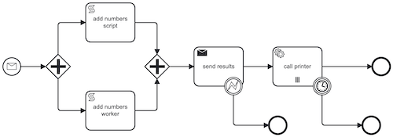
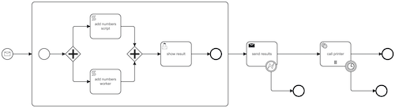
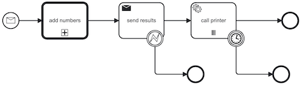

# Camunda 8.9 Process Automation Examples

This collection demonstrates key Camunda 8.9 process automation patterns, tested using a [Docker Compose deployment](https://github.com/camunda/camunda-distributions/tree/main/docker-compose/versions/camunda-8.9) with the [full configuration](https://github.com/camunda/camunda-distributions/blob/main/docker-compose/versions/camunda-8.9/docker-compose-full.yaml).

## Prerequisites

1. **Install dependencies**: Run `npm install` to install the [@Camunda8/sdk](https://camunda.github.io/camunda-8-js-sdk/) Node.js package used by all examples.

2. **Download and configure [Camunda Modeler](https://camunda.com/download/modeler/)**: 
   - Check if the "c8run" connection at the bottom of the window displays a green icon
   - If not, configure a new connection with these parameters:
     - **Target**: Camunda 8 Self-Managed
     - **Cluster URL**: `http://localhost:8080/v2`
     - **Operate URL**: `http://localhost:8080/operate`
     - **Tasklist URL**: `http://localhost:8080/tasklist`
     - **Authentication**: OAuth
     - **Client ID**: `orchestration`
     - **Client secret**: `secret`
     - **OAuth token URL**: `http://localhost:18080/auth/realms/camunda-platform/protocol/openid-connect/token`
     - **OAuth audience**: `orchestration-api`
     - **Tenant ID and OAuth scope**: Leave empty

## 1. Script Task

This example demonstrates how to execute inline code directly within a Camunda process using FEEL expressions. The script task runs logic without requiring an external service or worker.

**Task Configuration:**
- **Implementation**: FEEL expression
- **Result variable**: `sum_script`
- **Expression**: `a+b`

**To run this example:**
1. Open [script task model](./executable/add_numbers_script.bpmn) in Camunda Modeler
2. Deploy the model (click the :rocket: icon)
3. Start a new instance with variables: `{"a": 1, "b": 2}` (click :arrow_forward:)
4. Check [Operate dashboard](http://localhost:8080/operate) to verify the process completed and `sum_script` has the correct value

## 2. Worker Task

This example shows how to offload work to external services by using job workers. Workers subscribe to specific job types and process tasks outside the Camunda engine, enabling integration with external systems.

**Task Configuration:**
- **Implementation**: Job worker
- **Job type**: `add-numbers-worker`
- **Output mapping - Process variable**: `sum_worker`
- **Output mapping - Variable assignment**: `sum_result`

The worker implementation is in [add-numbers-worker.js](./src/worker/add-numbers-worker.js). It subscribes to the `add-numbers-worker` job type and processes incoming jobs.

**To run this example:**
1. Start the worker: `node ./src/worker/add-numbers-worker.js`
2. Open [worker task model](./executable/add_numbers_worker.bpmn) in Camunda Modeler
3. Deploy the model (click :rocket:)
4. Start a new instance with variables: `{"a": 1, "b": 2}` (click :arrow_forward:)
5. Verify in [Operate dashboard](http://localhost:8080/operate) that the process completed with correct values for `sum_script` and `sum_worker`

## 3. User Task

This example demonstrates how to involve human participants in a process using user tasks and interactive forms. Users can view process data and make decisions through a custom form.

**Task Configuration:**
- **Form Type**: Camunda Form
- **Form ID**: `add_numbers_results_form` (must match the ID in [form_result.form](./executable/form_result.form))

**To run this example:**
1. Start the worker: `node ./src/worker/add-numbers-worker.js` (if not already running)
2. Open [result form](./executable/form_result.form) in Camunda Modeler and deploy it (click :rocket:)
3. Open [user task model](./executable/add_numbers_user.bpmn) in Camunda Modeler and deploy it (click :rocket:)
4. Start a new instance with variables: `{"a": 1, "b": 2}` (click :arrow_forward:)
5. Go to [Tasklist](http://localhost:8080/tasklist) and complete the task
6. Verify in [Operate dashboard](http://localhost:8080/operate) that the process completed with correct values

## 4. Starting a Process Programmatically

This example shows how to initiate a process instance from an external application using the Camunda API. This is useful for triggering workflows based on external events or system actions.

The implementation is in [start_process.js](./src/start/start_process.js).

**To run this example:**
1. In the [Operate dashboard](http://localhost:8080/operate), select a deployed process with a "none start event"
2. Copy the process ID
3. Run: `node src/start/start_process.js [processId]`

**Process IDs from these examples:**
- `add-numbers-script`
- `add-numbers-worker`
- `add-numbers-user`

## 5. Starting a Process with a Message

This example demonstrates how to start a process instance by sending a message event. This is useful for event-driven workflows where external systems trigger process execution.

**Start Event Configuration:**
- **Message name**: `adding-numbers-message`

The message is sent using [start_process_message.js](./src/start/start_process_message.js).

**To run this example:**
1. Start the worker: `node ./src/worker/add-numbers-worker.js` (if not already running)
2. Open [start message model](./executable/add_numbers_start_message.bpmn) in Camunda Modeler and deploy it (click :rocket:)
3. Send the message: `node ./src/start/start_process_message.js adding-numbers-message`
4. Go to [Tasklist](http://localhost:8080/tasklist) and complete the task
5. Verify in [Operate dashboard](http://localhost:8080/operate) that the process completed successfully

## 6. Catching Messages from a Process

This example demonstrates how a BPMN process can send (throw) messages that are caught and processed by external workers. This enables two-way communication between Camunda and external systems.

A worker [catch_message_worker.js](./src/worker/catch_message_worker.js) listens for messages on the topic `process_results`. The process sends messages via an end event with these properties:
- **Local variable name**: `results`
- **Variable assignment value**: `{"sum_script": sum_script, "sum_worker": sum_worker}`

**To run this example:**
1. Start the main worker: `node ./src/worker/add-numbers-worker.js` (if not already running)
2. Start the message-catching worker: `node ./src/worker/catch_message_worker.js`
3. Open [end message model](./executable/add_numbers_end_message.bpmn) in Camunda Modeler and deploy it (click :rocket:)
4. Trigger the process: `node ./src/start/start_process_message.js adding-numbers-message-end`
5. Go to [Tasklist](http://localhost:8080/tasklist) and complete the task
6. Verify in [Operate dashboard](http://localhost:8080/operate) that the process completed with correct values

**Testing error handling:** Try modifying the `sum_script` or `sum_worker` values in the form to see how the process handles data mismatches.

## 7. Error Handling with Messages

This example extends the previous message-catching pattern with error handling. When a process throws a message that could fail, an error boundary event catches exceptions and handles them gracefully.

**Error Boundary Event Configuration:**
- **Error name**: `error-results-mismatch`
- **Error code**: `error-results-mismatch`

The [catch_message_worker_error.js](./src/worker/catch_message_worker_error.js) handles these error messages.

**To run this example:**
1. Start the main worker: `node ./src/worker/add-numbers-worker.js` (if not already running)
2. Start the error-handling worker: `node ./src/worker/catch_message_worker_error.js`
3. Open [error message model](./executable/add_numbers_error.bpmn) in Camunda Modeler and deploy it (click :rocket:)
4. Trigger the process: `node ./src/start/start_process_message.js adding-numbers-message-error`
5. Go to [Tasklist](http://localhost:8080/tasklist) and complete the task
6. Verify in [Operate dashboard](http://localhost:8080/operate) that the process completed successfully

## 8. Multi-Instance Activities

This example demonstrates how to execute a task multiple times in parallel or sequence. Multi-instance markers enable looping constructs for processing collections of data.

**Note:** Camunda doesn't support standard loops. Use either explicit gateways or the multi-instance marker. See the [Camunda documentation](https://docs.camunda.io/docs/components/modeler/bpmn/multi-instance/) for details.

The [printer_worker.js](./src/worker/printer-worker.js) implements the worker for the multi-instance task.

**To run this example:**
1. Start the main worker: `node ./src/worker/add-numbers-worker.js` (if not already running)
2. Start the error-handling worker: `node ./src/worker/catch_message_worker_error.js` (if not already running)
3. Start the printer worker: `node ./src/worker/printer-worker.js`
4. Open [multi-instance model](./executable/add_numbers_multi.bpmn) in Camunda Modeler and deploy it (click :rocket:)
5. Trigger the process: `node ./src/start/start_process_message.js adding-numbers-message-multi`
6. Go to [Tasklist](http://localhost:8080/tasklist) and complete the task
7. Check the printer-worker logs to see how jobs were executed in parallel

## 9. Boundary Events

This example shows how boundary events can interrupt a running activity. Timer events are particularly useful for implementing timeouts and handling long-running tasks.

See the [Camunda documentation](https://docs.camunda.io/docs/components/modeler/bpmn/timer-events/) for details on configuring timer expressions.

**To run this example:**
1. Start the main worker: `node ./src/worker/add-numbers-worker.js` (if not already running)
2. Start the error-handling worker: `node ./src/worker/catch_message_worker_error.js` (if not already running)
3. Start the printer worker: `node ./src/worker/printer-worker.js` (if not already running)
4. Open [multi-instance with timer model](./executable/add_numbers_multi-timer.bpmn) in Camunda Modeler and deploy it (click :rocket:)
5. Trigger the process: `node ./src/start/start_process_message.js adding-numbers-message-multi-timer`
6. Go to [Tasklist](http://localhost:8080/tasklist) and complete the task before the timer fires
7. Verify in [Operate dashboard](http://localhost:8080/operate) how the timer boundary event was handled

## 10. Subprocesses

This example demonstrates how to use subprocesses as grouping mechanisms to organize and structure complex processes. A key consideration is proper variable scoping.

**Variable Scoping:**
- **Process variables** (`a`, `b`, `sum_worker`, `sum_script`) are shared across the parent process and subprocess
- **Subprocess variables** are scoped only to the subprocess unless explicitly mapped
- **Variable mapping** is required to pass data between parent and subprocess

See the [Camunda documentation on variable mappings](https://docs.camunda.io/docs/components/concepts/variables/#inputoutput-variable-mappings) for more details.

**To run this example:**
- Follow the same steps as the multi-instance example with boundary events

## 11. Call Activities

This example shows how to use a call activity to invoke a reusable subprocess. Unlike embedded subprocesses, call activities reference other process definitions, enabling process composition and reusability across multiple parent processes.

**To run this example:**
- Follow the same steps as the multi-instance example with boundary events